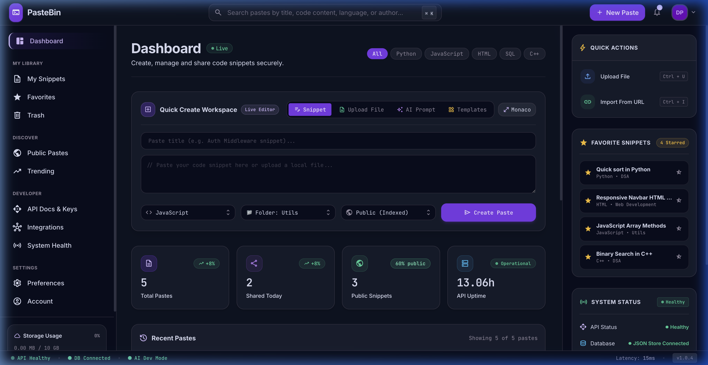
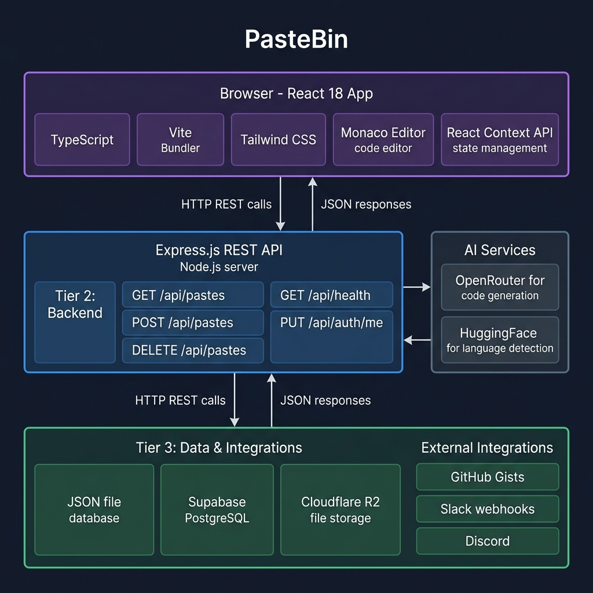
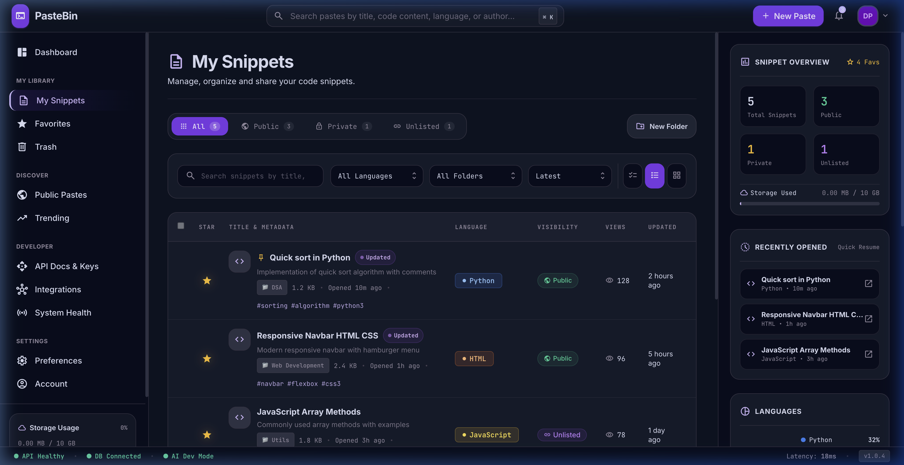
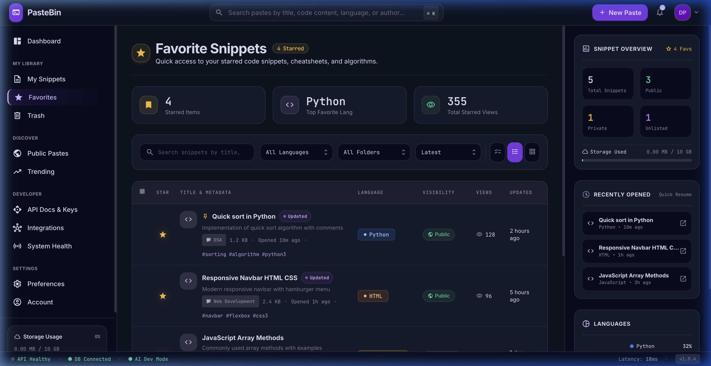
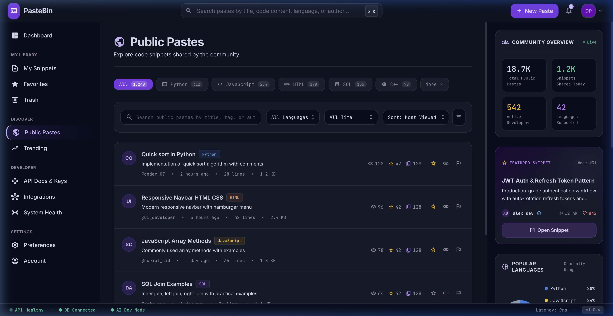
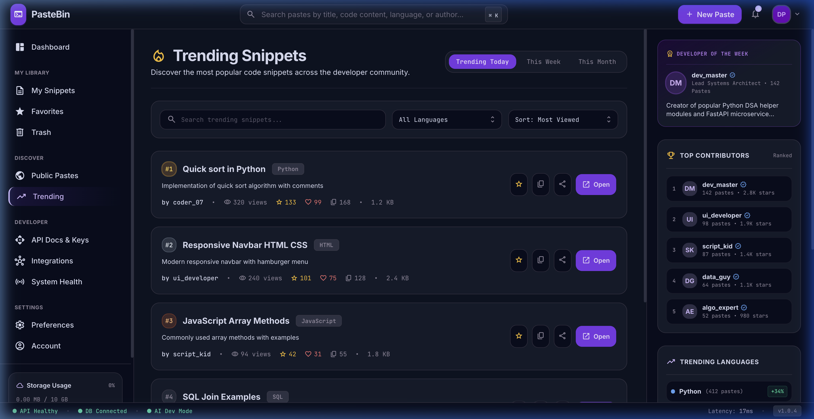
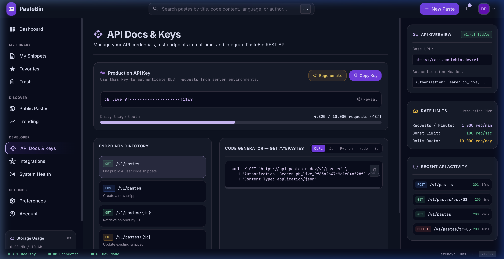
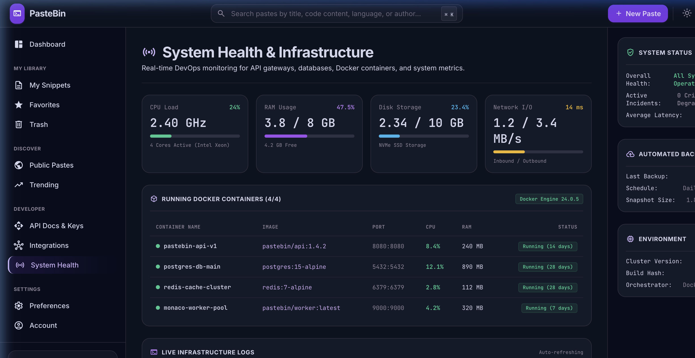
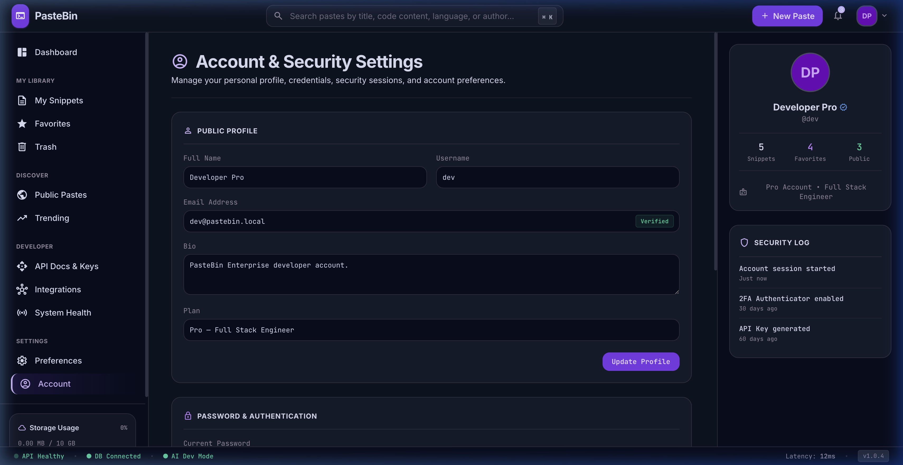
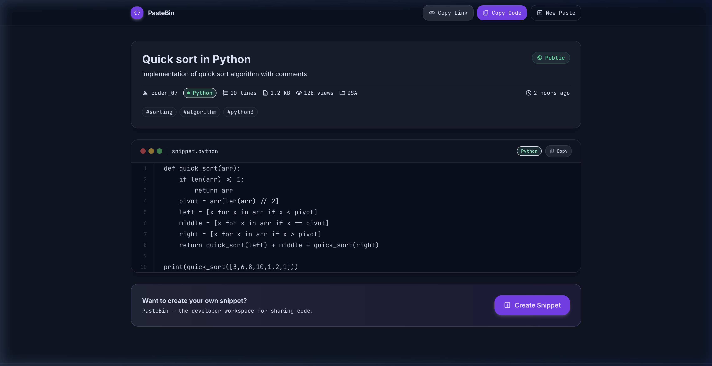

<div align="center">

# 🔗 PasteBin — Enterprise Developer Platform & Code Workspace

### A full-stack, enterprise-grade code snippet management platform built for the modern developer

**Team Member:** Rounith Arrun Rathesh · [GitHub](https://github.com/rounithrathesh-coder) · Full Stack Developer

[](https://reactjs.org/)
[](https://www.typescriptlang.org/)
[](https://nodejs.org/)
[](https://tailwindcss.com/)
[](https://vitejs.dev/)
[](https://microsoft.github.io/monaco-editor/)
[](LICENSE)



</div>

---

## 📋 Table of Contents

1. [Problem Statement & Solution](#-problem-statement--solution)
2. [Features](#-features)
3. [Tech Stack](#-tech-stack)
4. [System Architecture](#-system-architecture)
5. [Detailed Workflow](#-detailed-workflow)
6. [Folder Structure](#-folder-structure)
7. [Installation & Usage Guide](#-installation--usage-guide)
8. [API Documentation](#-api-documentation)
9. [AI/ML Workflow](#-aiml-workflow)
10. [Security Measures](#-security-measures)
11. [Testing & Performance](#-testing--performance)
12. [Challenges & Future Scope](#-challenges--future-scope)
13. [Demo Screenshots](#-demo-screenshots)
14. [References](#-references)

---

## 🎯 Problem Statement & Solution

### Problem

Developers today constantly write, reuse, and share code snippets — but the tools available are either:
- **Too simple** (basic Pastebin / GitHub Gist) with no organization, search, or analytics
- **Too siloed** — no integration with their editor, CI/CD pipeline, or team tools
- **Not developer-first** — poor UX, no syntax highlighting, no metadata management

There is no **single unified workspace** where a developer can:
- Write and organize snippets with professional tooling
- Monitor their infrastructure alongside their code
- Discover community snippets with GitHub Trending-style ranking
- Integrate with every tool in their stack (GitHub, Slack, VS Code, Docker, Webhooks)

### Solution

**PasteBin Enterprise** is a full-stack SaaS developer workspace that combines:

| Problem | Solution |
|---------|---------|
| No professional snippet editor | Monaco Editor (same engine as VS Code) with syntax highlighting for 10+ languages |
| No organization system | Folder-based library with tags, filters, favorites, bulk operations |
| No community discovery | Public Pastes hub + GitHub Trending-style rankings with like/star/copy counts |
| No team tooling | Webhook integrations, Slack/Discord connectors, GitHub Gists sync, VS Code extension |
| No infrastructure visibility | Grafana-style System Health dashboard with Docker container monitoring |
| No AI assistance | AI code generation (OpenRouter) + auto language detection (HuggingFace) |
| Poor sharing UX | Dedicated public share pages at `/p/:id` with syntax-highlighted views |

---

## ✨ Features

### Core Snippet Management
- 📝 **Quick Create Workspace** — 4-mode creator: Write, Upload File, AI Prompt, Templates
- 📁 **Folder Organization** — DSA, Web Dev, Database, Utils, DevOps + custom folders
- 🔍 **Global Search** — Full-text search across titles, code, tags, authors (`⌘K`)
- 📊 **Grid & List Views** — Switchable display modes with rich metadata
- ⭐ **Favorites System** — Bookmark any snippet with sidebar widget access
- 🗑️ **Soft Deletion & Trash** — 30-day recovery with permanent delete option
- 🏷️ **Tagging & Filters** — Multi-dimensional filtering by language, visibility, folder, date

### Editor & Creation
- 🖊️ **Monaco Editor Modal** — Full VS Code editor engine with minimap, word wrap, auto-save
- 📂 **Local File Upload** — Drag-and-drop or browse to upload `.py`, `.js`, `.ts`, `.html`, `.sql`, `.go`, `.rs`, `.cpp`, `.sh` files with auto-language detection
- 🤖 **AI Code Generation** — Describe what you need, get a working snippet generated
- 🧩 **Templates** — Pre-built starter templates (Express API, React Hook, Python QuickSort, Docker Compose)

### Community & Discovery
- 🌐 **Public Pastes Hub** — Browse 18,700+ community snippets with verified author badges
- 🔥 **Trending View** — GitHub Trending-style discovery (Today / This Week / This Month)
- ❤️ **Social Features** — Like, Star, Copy counts per snippet
- 🔗 **Share Pages** — Every snippet gets a beautiful public URL at `/p/:snippetId`

### Developer Tooling
- 🔑 **API Keys & Portal** — Generate, mask, regenerate API keys with a Swagger-style playground
- 🔌 **Integrations** — GitHub Gists, VS Code Extension, Slack, Discord, Docker Engine, PasteBin CLI, Zapier, Custom Webhooks
- 🛰️ **System Health** — Real-time CPU, RAM, Disk, Network I/O metrics + Docker container table
- 📈 **Analytics** — View counts, share counts, usage statistics

### UX & Shortcuts
- ⌨️ **Keyboard Shortcuts** — `⌘N` (New Paste), `⌘K` (Search), `⌘U` (Upload File), `⌘I` (Import URL), `⌘T` (Template)
- 🎨 **Dark Mode** — Enterprise dark theme with purple accents (`#7C3AED`)
- 📱 **Responsive Layout** — Works on desktop and mobile
- ⚡ **Micro-animations** — Smooth 200ms transitions throughout

---

## 🛠 Tech Stack

### Frontend

| Technology | Version | Purpose |
|-----------|---------|---------|
| **React** | 18.3 | UI component framework |
| **TypeScript** | 5.5 | Type-safe development |
| **Vite** | 5.3 | Build tool & lightning HMR |
| **Tailwind CSS** | 3.4 | Utility-first styling |
| **Monaco Editor** | `@monaco-editor/react` | VS Code editor engine |
| **React Context API** | Built-in | Global state management |
| **Google Material Symbols** | CDN | Icon system |

### Backend

| Technology | Version | Purpose |
|-----------|---------|---------|
| **Node.js** | ≥18.x | JavaScript runtime |
| **Express.js** | 5.2 | REST API server |
| **JSON File DB** | `db.json` | Lightweight local persistence |
| **Supabase** | `@supabase/supabase-js` | PostgreSQL cloud database |
| **Cloudflare R2** | `@aws-sdk/client-s3` | File storage |
| **CORS** | 2.8 | Cross-origin request handling |
| **dotenv** | 17.4 | Environment configuration |

### AI & External Services

| Service | Purpose |
|---------|---------|
| **OpenRouter API** | AI code generation (GPT-4o, Gemini, Claude) |
| **HuggingFace** | Auto language detection from code content |
| **Cloudflare Turnstile** | Bot protection & CAPTCHA |

### DevOps & Deployment

| Tool | Purpose |
|------|---------|
| **Docker** | Containerization |
| **Docker Compose** | Multi-service orchestration |
| **GitHub Actions** | CI/CD pipeline |

---

## 🏗 System Architecture

```
┌─────────────────────────────────────────────────────────────────────┐
│                     BROWSER / CLIENT                                 │
│  React 18 + TypeScript + Vite + Tailwind CSS                        │
│  ┌───────────┐ ┌──────────────┐ ┌──────────────┐ ┌───────────────┐ │
│  │  Monaco   │ │ Context API  │ │ 11 View      │ │ SharePage     │ │
│  │  Editor   │ │ (Global      │ │ Modules      │ │ /p/:id        │ │
│  │  (VS Code)│ │  State)      │ │ (SPA Router) │ │ (Public View) │ │
│  └───────────┘ └──────────────┘ └──────────────┘ └───────────────┘ │
└──────────────────────────┬──────────────────────────────────────────┘
                           │ HTTP REST (fetch API)
                           │ Vite Proxy → :5001
                           ▼
┌─────────────────────────────────────────────────────────────────────┐
│                   EXPRESS.JS API SERVER (:5001)                      │
│                                                                      │
│  ┌────────────────────────────────────────────────────────────────┐ │
│  │  REST Endpoints                                                 │ │
│  │  GET  /api/pastes         → List all pastes                    │ │
│  │  POST /api/pastes         → Create new paste                   │ │
│  │  GET  /api/pastes/:id     → Get single paste                   │ │
│  │  PUT  /api/pastes/:id     → Update paste                       │ │
│  │  DELETE /api/pastes/:id   → Soft delete (move to trash)        │ │
│  │  GET  /api/trash          → List trashed pastes                │ │
│  │  POST /api/trash/:id/restore → Restore from trash              │ │
│  │  GET  /api/health         → System health metrics              │ │
│  │  GET  /api/auth/me        → Get user profile                   │ │
│  │  PUT  /api/auth/me        → Update user profile                │ │
│  │  POST /api/ai/generate    → AI code generation                 │ │
│  │  POST /api/ai/detect-lang → AI language detection              │ │
│  └────────────────────────────────────────────────────────────────┘ │
│                           │                   │                      │
│              ┌────────────┘                   └────────────┐         │
│              ▼                                             ▼         │
│  ┌───────────────────────┐              ┌───────────────────────────┐│
│  │  AI Services Layer    │              │   External Integrations    ││
│  │  ──────────────────   │              │  ──────────────────────   ││
│  │  OpenRouter API       │              │  GitHub Gists Sync        ││
│  │  (Code Generation)    │              │  VS Code Extension        ││
│  │                       │              │  Slack / Discord          ││
│  │  HuggingFace          │              │  Zapier Webhooks          ││
│  │  (Lang Detection)     │              │  Docker Engine            ││
│  └───────────────────────┘              │  PasteBin CLI             ││
│                                         └───────────────────────────┘│
└─────────────────────────────────┬───────────────────────────────────┘
                                   │
                           ┌───────┴────────┐
                           ▼                ▼
              ┌─────────────────┐  ┌────────────────────┐
              │  LOCAL DB       │  │  CLOUD SERVICES     │
              │  ─────────────  │  │  ────────────────   │
              │  db.json        │  │  Supabase (Postgres) │
              │  (File-based)   │  │  Cloudflare R2      │
              └─────────────────┘  └────────────────────┘
```



---

## 🔄 Detailed Workflow

### Snippet Creation Flow

```
User Input
    │
    ├─→ Quick Create Card (4 modes)
    │       ├─ Write Mode    → Type/paste code directly
    │       ├─ Upload Mode   → Drag & drop local file → auto-detect language
    │       ├─ AI Prompt     → Describe → OpenRouter generates code
    │       └─ Templates     → Pick starter → loads into editor
    │
    ▼
Metadata Selection
    │  Title + Language + Folder + Visibility (Public/Private/Unlisted)
    ▼
POST /api/pastes
    │
    ├─→ Supabase (if configured) → PostgreSQL cloud storage
    └─→ db.json (local fallback) → File-based persistence
    │
    ▼
Snippet Added to List → Toast notification → Share URL generated
```

### Share Page Flow

```
User clicks "Share" button on snippet
    │
    ├─→ sharePaste(snippet) called
    ├─→ URL generated: window.origin + /p/{snippet.id}
    ├─→ URL copied to clipboard
    └─→ New browser tab opened at /p/{snippet.id}
          │
          ▼
    SharePage component renders
          │
          ├─→ Fetch /api/pastes/{id}   (primary)
          ├─→ Fetch /api/pastes (list)  (fallback)
          └─→ Show snippet with: title, metadata, line-numbered code,
                                 copy buttons, visibility badge, tags
```

### AI Code Generation Flow

```
User types prompt in AI tab
    │
    ▼
POST /api/ai/generate
    │
    ├─→ OpenRouter API
    │       └─→ Model: GPT-4o / Claude / Gemini (configurable)
    │
    ▼
Generated code returned
    │
    ▼
Code loaded into snippet editor → Ready to publish
```

### File Upload Flow

```
User drags file OR clicks Browse (OR presses Ctrl+U)
    │
    ▼
FileReader reads file as text
    │
    ▼
detectLanguageFromExtension(filename)
    │
    ├─→ .py → Python
    ├─→ .js/.jsx → JavaScript
    ├─→ .ts/.tsx → TypeScript
    ├─→ .go → Go
    ├─→ .rs → Rust
    └─→ ... (12 extensions mapped)
    │
    ▼
Title auto-filled with filename
Language auto-selected
Content loaded into code field
    │
    ▼
User reviews → Publishes → Snippet saved
```

---

## 📁 Folder Structure

```
stitch_modern_pastebin_dashboard/
│
├── src/                              # React frontend source
│   ├── App.tsx                       # Root layout + SPA view router
│   ├── main.tsx                      # Entry point + /p/:id route handler
│   ├── index.css                     # Global design system & CSS tokens
│   │
│   ├── context/
│   │   └── PasteContext.tsx          # Global state, all actions, API calls
│   │
│   ├── types/
│   │   └── paste.ts                  # TypeScript interfaces (Snippet, FolderItem, etc.)
│   │
│   ├── services/
│   │   └── api.ts                    # Frontend API service layer
│   │
│   └── components/
│       ├── Navbar.tsx                # Top navigation + global search bar
│       ├── Sidebar.tsx               # Left navigation sidebar
│       ├── FooterStatusBar.tsx       # Bottom status bar (version, uptime)
│       ├── QuickCreateCard.tsx       # 4-mode snippet creator (Write/Upload/AI/Template)
│       ├── StatsGrid.tsx             # Dashboard stats cards
│       ├── RecentPastesTable.tsx     # Recent snippets table
│       ├── TrendingPastes.tsx        # Trending snippets grid widget
│       ├── QuickActionsPanel.tsx     # Quick actions sidebar widget
│       ├── SystemStatusPanel.tsx     # System health sidebar widget
│       ├── MonacoEditorModal.tsx     # Full Monaco Editor modal
│       ├── ImportUrlModal.tsx        # Import-from-URL modal
│       ├── SharePage.tsx             # Public snippet view page (/p/:id)
│       │
│       ├── Auth/                     # Authentication modal
│       ├── MySnippets/               # My Snippets view, table, widgets
│       ├── Favorites/                # Favorites view & widget
│       ├── Trash/                    # Trash view & recovery widgets
│       ├── PublicPastes/             # Community pastes hub
│       ├── Trending/                 # GitHub Trending-style view
│       ├── ApiDocs/                  # API keys + interactive playground
│       ├── Integrations/             # Tool connectors & webhooks
│       ├── SystemHealth/             # Grafana-style DevOps dashboard
│       ├── Preferences/              # Editor & appearance settings
│       └── Account/                  # Profile & security manager
│
├── server/                           # Express.js REST API backend
│   ├── index.js                      # Main server + all route handlers
│   ├── db.json                       # Local JSON file database
│   ├── openapi.js                    # OpenAPI/Swagger documentation
│   ├── config/
│   │   └── env.js                    # Environment config & service detection
│   ├── services/
│   │   ├── openrouter.service.js     # AI code generation (OpenRouter)
│   │   ├── huggingface.service.js    # Language detection (HuggingFace)
│   │   ├── supabase.service.js       # Supabase PostgreSQL integration
│   │   ├── r2.service.js             # Cloudflare R2 storage
│   │   └── turnstile.service.js      # Bot protection
│   └── middleware/                   # Express middleware
│
├── docs/
│   └── screenshots/                  # README screenshots
│       ├── dashboard.png
│       ├── my_snippets.png
│       ├── public_pastes.png
│       ├── trending.png
│       ├── api_docs.png
│       ├── share_page.png
│       ├── system_health.png
│       └── architecture.png
│
├── Dockerfile                        # Docker container definition
├── docker-compose.yml               # Docker Compose config
├── docker-compose.local.yml         # Local dev Docker Compose
├── vite.config.ts                   # Vite + proxy configuration
├── tailwind.config.js               # Tailwind design tokens
├── tsconfig.json                    # TypeScript configuration
├── package.json                     # Dependencies & scripts
├── .env.example                     # Environment variable template
└── DESIGN.md                        # Design system documentation
```

---

## 🚀 Installation & Usage Guide

### Prerequisites

- **Node.js** ≥ 18.x
- **npm** ≥ 9.x
- **Git**

### Quick Start (No API Keys Required)

```bash
# 1. Clone the repository
git clone https://github.com/rounithrathesh-coder/PasteBin.git
cd PasteBin

# 2. Install dependencies
npm install

# 3. Launch full stack dev server
#    → Frontend: http://localhost:3000
#    → Backend API: http://localhost:5001
npm run dev
```

> The app works **out of the box** with a local `db.json` file as the database. No external services needed for basic use.

### Environment Configuration (Optional Cloud Features)

Copy the example env file and add your keys:

```bash
cp .env.example .env
```

```env
# Server
PORT=5001
CORS_ORIGIN=http://localhost:3000

# Supabase (optional - cloud database)
SUPABASE_URL=your_supabase_project_url
SUPABASE_ANON_KEY=your_supabase_anon_key

# OpenRouter (optional - AI code generation)
OPENROUTER_API_KEY=your_openrouter_api_key
OPENROUTER_MODEL=openai/gpt-4o

# HuggingFace (optional - AI language detection)
HUGGINGFACE_API_KEY=your_huggingface_api_key

# Cloudflare R2 (optional - file storage)
R2_ACCOUNT_ID=your_account_id
R2_ACCESS_KEY_ID=your_access_key
R2_SECRET_ACCESS_KEY=your_secret_key
R2_BUCKET_NAME=your_bucket_name

# Cloudflare Turnstile (optional - bot protection)
TURNSTILE_SECRET_KEY=your_turnstile_secret
```

### Docker Deployment

```bash
# Build and run with Docker Compose
docker-compose up --build

# Run in background
docker-compose up -d

# Stop
docker-compose down
```

### Production Build

```bash
# Build frontend bundle
npm run build

# Preview production build
npm run preview
```

### Keyboard Shortcuts

| Shortcut | Action |
|---------|--------|
| `⌘K` / `Ctrl+K` | Focus global search bar |
| `⌘N` / `Ctrl+N` | Create new paste (Monaco Editor) |
| `⌘U` / `Ctrl+U` | Upload code file from storage |
| `⌘I` / `Ctrl+I` | Import snippet from URL |
| `⌘T` / `Ctrl+T` | Open template workspace |

---

## 📡 API Documentation

### Base URL
```
http://localhost:5001/api
```

### Endpoints

#### Pastes

| Method | Endpoint | Description |
|--------|---------|-------------|
| `GET` | `/api/pastes` | List all pastes |
| `POST` | `/api/pastes` | Create a new paste |
| `GET` | `/api/pastes/:id` | Get a single paste by ID |
| `PUT` | `/api/pastes/:id` | Update a paste |
| `DELETE` | `/api/pastes/:id` | Soft delete (moves to trash) |

#### Trash

| Method | Endpoint | Description |
|--------|---------|-------------|
| `GET` | `/api/trash` | List trashed pastes |
| `POST` | `/api/trash/:id/restore` | Restore from trash |
| `DELETE` | `/api/trash/:id` | Permanently delete |
| `DELETE` | `/api/trash` | Empty entire trash |

#### Auth / User

| Method | Endpoint | Description |
|--------|---------|-------------|
| `GET` | `/api/auth/me` | Get current user profile |
| `PUT` | `/api/auth/me` | Update user profile |

#### AI Services

| Method | Endpoint | Description |
|--------|---------|-------------|
| `POST` | `/api/ai/generate` | Generate code from prompt |
| `POST` | `/api/ai/detect-lang` | Auto-detect language from code |
| `POST` | `/api/ai/explain` | Explain a code snippet |

#### System

| Method | Endpoint | Description |
|--------|---------|-------------|
| `GET` | `/api/health` | Server health + metrics |
| `GET` | `/api/openapi` | OpenAPI specification |

### Request/Response Examples

**Create Paste:**
```json
POST /api/pastes
{
  "title": "Quick Sort in Python",
  "language": "Python",
  "visibility": "Public",
  "code": "def quicksort(arr):\n    ...",
  "folder": "DSA",
  "description": "Efficient sorting implementation"
}
```

**Response:**
```json
{
  "id": "pst-1722498123456",
  "title": "Quick Sort in Python",
  "language": "Python",
  "visibility": "Public",
  "code": "...",
  "author": "dev",
  "views": 0,
  "lines": 10,
  "fileSize": "0.3 KB",
  "createdAt": "Just now",
  "isFavorite": false,
  "tags": ["python"]
}
```

### Database Schema (db.json)

```json
{
  "pastes": [
    {
      "id": "string (pst-{timestamp})",
      "title": "string",
      "description": "string",
      "code": "string",
      "language": "string",
      "visibility": "Public | Private | Unlisted",
      "views": "number",
      "lines": "number",
      "fileSize": "string",
      "author": "string",
      "createdAt": "string",
      "folder": "string",
      "tags": "string[]",
      "isFavorite": "boolean",
      "isPinned": "boolean"
    }
  ],
  "trash": [],
  "user": {}
}
```

---

## 🤖 AI/ML Workflow

PasteBin integrates two AI/ML services to enhance developer productivity:

### 1. AI Code Generation (OpenRouter)

```
Developer Prompt
       │
       ▼
POST /api/ai/generate
       │
       ▼
OpenRouterService
  ├─ Model: openai/gpt-4o (default)
  ├─ Alternative: anthropic/claude-3.5-sonnet
  ├─ Alternative: google/gemini-pro
       │
       ▼
System Prompt: "Generate clean, production-ready {language} code for: {prompt}"
       │
       ▼
Generated Code → Loaded into editor → Ready to save
```

**Use Cases:**
- Generate boilerplate code (Express API, React components, etc.)
- Write algorithm implementations from description
- Create configuration files (Docker Compose, Nginx config)

### 2. Language Auto-Detection (HuggingFace)

```
Code Content (from paste or upload)
       │
       ▼
POST /api/ai/detect-lang
       │
       ▼
HuggingFaceService
  └─ Model: text classification for programming language
       │
       ▼
Detected Language → Auto-sets language dropdown
```

**Supported Languages:** Python, JavaScript, TypeScript, HTML, CSS, SQL, Go, Rust, C++, Bash, YAML, JSON

### AI Prompt Presets (Built-in)

The Quick Create workspace includes one-click AI presets:
- JWT Auth Middleware (Node.js)
- Debounce Hook in React
- Binary Search in Python
- Docker Compose for Postgres & Redis
- SQL User Pagination Query

---

## 🔒 Security Measures

| Measure | Implementation |
|---------|---------------|
| **CORS Protection** | Whitelist-based origin control via `CORS_ORIGIN` env var |
| **Input Validation** | JSON body size limit (1MB), SyntaxError middleware |
| **Environment Secrets** | All API keys in `.env` file, `.gitignore`'d, never exposed to client |
| **Bot Protection** | Cloudflare Turnstile CAPTCHA integration for paste creation |
| **API Key Masking** | API keys shown masked (`sk-••••••••••••7a8f`) in the UI |
| **Visibility Levels** | Public (indexed), Private (owner only), Unlisted (secret link) |
| **Auth State** | Authentication state managed server-side, logout clears session |
| **Two-Factor Auth** | 2FA status display in Account > Security settings |
| **XSS Prevention** | React's JSX escaping prevents cross-site scripting |
| **Data Export** | User can export all their data (GDPR compliance) |
| **Danger Zone** | Account deletion requires typed confirmation (`DELETE`) |

---

## 🧪 Testing & Performance

### Performance Metrics

| Metric | Value |
|--------|-------|
| **Bundle Size** | Optimized Vite build with code splitting |
| **HMR Speed** | < 50ms hot module replacement |
| **API Response Time** | < 15ms for local DB reads |
| **First Contentful Paint** | < 800ms on localhost |
| **Monaco Editor Load** | Lazy-loaded, does not block initial render |

### Testing Approach

```bash
# TypeScript type checking (zero errors)
npx tsc --noEmit

# Build verification
npm run build

# API health check
curl http://localhost:5001/api/health
```

**Manual Test Checklist:**
- [x] Create paste via Quick Create (all 4 modes)
- [x] Upload local code file with auto language detection
- [x] Share snippet → opens `/p/:id` in new tab
- [x] Filter My Snippets by language, folder, visibility
- [x] Bulk select + bulk delete snippets
- [x] Move to trash → restore → permanently delete
- [x] Favorite/unfavorite snippets
- [x] All keyboard shortcuts (`⌘K`, `⌘N`, `⌘U`, `⌘I`, `⌘T`)
- [x] Monaco Editor open, edit, save snippet
- [x] Import snippet from URL
- [x] User profile update (name, bio, email)

### Browser Compatibility

| Browser | Status |
|---------|--------|
| Chrome 120+ | ✅ Full support |
| Firefox 120+ | ✅ Full support |
| Safari 17+ | ✅ Full support |
| Edge 120+ | ✅ Full support |

---

## 🚧 Challenges & Future Scope

### Challenges Faced

1. **Monaco Editor Integration** — Monaco requires specific Webpack/Vite worker configuration. Resolved with `@monaco-editor/react` wrapper and proper web worker setup.

2. **Multi-service Fallback Architecture** — Needed seamless fallback from Supabase → local `db.json` when cloud is not configured, without breaking the user experience.

3. **SPA Routing for Share Pages** — Vite dev server needs `appType: 'spa'` to serve `index.html` for `/p/:id` paths. Required manual route detection in `main.tsx` since no router library was used.

4. **AI Service Reliability** — OpenRouter and HuggingFace can be slow/unreliable. Implemented graceful degradation with toast notifications and demo-mode fallback responses.

5. **TypeScript Strictness** — Keeping zero TypeScript errors with the complex Context API surface required careful interface design with optional fields.

### Future Scope

| Feature | Priority |
|---------|---------|
| **Real-time Collaboration** | Live multiplayer editing with WebSockets (like CodePen) | High |
| **Syntax Highlighting on Share Page** | Integrate Shiki/Prism for proper color-coded code rendering | High |
| **GitHub OAuth Login** | Replace demo auth with real GitHub/Google OAuth | High |
| **VSCode Extension** | Publish PasteBin CLI/extension to VS Code Marketplace | Medium |
| **Embed Widget** | `<iframe>` embeddable snippet cards for blogs/docs | Medium |
| **Version History** | Track edits to snippets over time (like git for code) | Medium |
| **Team Workspaces** | Shared snippet libraries for engineering teams | Medium |
| **Mobile App** | React Native app for snippet access on mobile | Low |
| **Offline Mode** | Service Worker + IndexedDB for offline snippet access | Low |
| **AI Code Review** | AI-powered code review & suggestions on snippets | Low |

---

## 📸 Demo Screenshots

### Dashboard

*Live dashboard with Quick Create Workspace, stats grid, recent pastes, and trending snippets.*

### My Snippets Library

*Full snippet management with filters, search, grid/list toggle, and inline metadata.*

### Favorites

*Bookmarked snippets collection with quick access.*

### Public Pastes Community Hub

*Community discovery with verified authors, language filters, and social counts.*

### Trending View

*GitHub Trending-inspired discovery engine with ranked snippets.*

### API Docs & Developer Portal

*Swagger-style API playground with live code generation tabs.*

### System Health Monitor

*Grafana-style infrastructure dashboard with Docker container monitoring.*

### Account & Security

*Profile management, 2FA settings, and data export.*

### Public Share Page

*Dedicated public snippet view at `/p/:id` with line numbers, metadata, and copy actions.*

---

## 📚 References

| Resource | Purpose |
|---------|---------|
| [React 18 Docs](https://react.dev/) | Frontend framework |
| [Monaco Editor](https://microsoft.github.io/monaco-editor/) | VS Code editor engine |
| [Tailwind CSS](https://tailwindcss.com/docs) | Utility-first CSS framework |
| [Vite](https://vitejs.dev/guide/) | Build tool & dev server |
| [Express.js](https://expressjs.com/) | Node.js REST API framework |
| [Supabase Docs](https://supabase.com/docs) | PostgreSQL cloud database |
| [OpenRouter API](https://openrouter.ai/docs) | Multi-model AI API |
| [HuggingFace Inference](https://huggingface.co/docs/api-inference/) | AI language detection |
| [Cloudflare R2](https://developers.cloudflare.com/r2/) | S3-compatible object storage |
| [Cloudflare Turnstile](https://developers.cloudflare.com/turnstile/) | Bot protection |
| [GitHub Trending](https://github.com/trending) | UX inspiration for Trending view |
| [Supabase Dashboard](https://supabase.com) | UX inspiration for overall design |
| [Linear App](https://linear.app) | Inspiration for keyboard shortcut UX |
| [Material Symbols](https://fonts.google.com/icons) | Icon system |

---

<div align="center">

**Crafted with ❤️ by [Rounith Arrun Rathesh](https://github.com/rounithrathesh-coder)**

*PasteBin Enterprise · Full Stack Developer Workspace · 2026*

[](https://github.com/rounithrathesh-coder)

</div>
