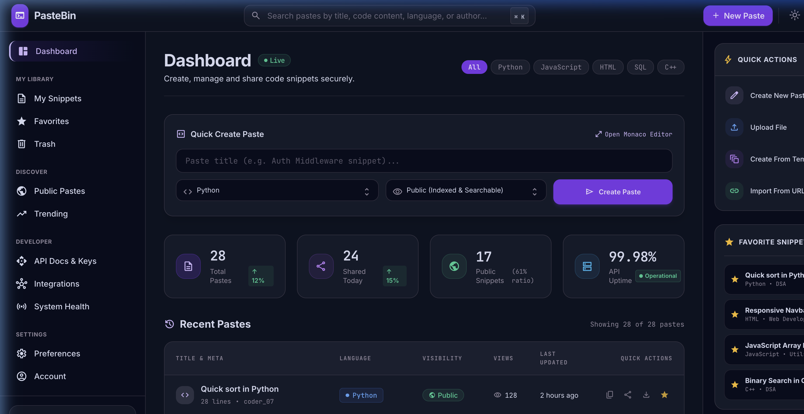

<div align="center">

# 🔗 PasteBin — Modern Developer Workspace

A premium, production-grade code snippet management platform built with **React**, **TypeScript**, **Tailwind CSS**, and **Vite**. Designed with the polish and information architecture of tools like GitHub, Supabase, Linear, and VS Code.



[](https://reactjs.org/)
[](https://www.typescriptlang.org/)
[](https://tailwindcss.com/)
[](https://vitejs.dev/)
[](https://microsoft.github.io/monaco-editor/)

</div>

---

## ✨ Overview

PasteBin is a full-featured developer workspace for creating, managing, organizing, and sharing code snippets. It features a dark-themed interface with a professional SaaS-grade navigation system, real-time Monaco code editor, and comprehensive snippet management tools.

This is not a basic pastebin clone — it's a **production-quality developer platform** with modular architecture, rich data visualization, and a premium design language.

---

## 🚀 Features

### Core Platform
- **Dashboard** — Overview with statistics, recent pastes, trending snippets, and quick actions
- **My Snippets** — Full snippet management with search, filters, sorting, pagination, and bulk actions
- **Favorites** — Bookmarked snippets for quick access
- **Monaco Editor** — VS Code-grade integrated code editor with syntax highlighting for 10+ languages

### Snippet Management
- **CRUD Operations** — Create, read, update, and delete snippets
- **Visibility Controls** — Public, Private, and Unlisted snippet modes
- **Folder Organization** — Organize snippets into named folders
- **Tagging System** — Tag snippets for easy discovery
- **Bulk Actions** — Multi-select and bulk delete operations
- **Code Preview** — Inline 2-line code previews in snippet rows
- **Download & Share** — One-click code download and share link generation

### Navigation & Architecture
- **Dashboard** — Overview and quick actions
- **My Library** — My Snippets, Favorites, Trash
- **Discover** — Public Pastes, Trending
- **Developer** — API Docs & Keys, Integrations, System Health
- **Settings** — Preferences, Account

### Design & UX
- **Dark Theme** — Premium dark interface with purple accent palette
- **Glassmorphism** — Frosted glass effects and subtle gradients
- **Responsive Layout** — Three-column adaptive layout
- **Micro-Animations** — Smooth hover states, transitions, and feedback
- **Grid & List Views** — Toggle between list and grid display modes
- **Global Search** — ⌘K powered search across titles, code, tags, and authors

### Widgets
- **Quick Actions** — Create, upload, template, and import shortcuts
- **Favorite Snippets** — Quick-access favorites widget
- **System Status** — Live API health, Docker, PostgreSQL, and uptime monitoring
- **Language Distribution** — Donut chart showing language breakdown
- **Storage Usage** — Visual storage quota indicator
- **Recently Opened** — Resume recent work quickly

---

## 🛠 Tech Stack

| Layer | Technology |
|---|---|
| **Framework** | React 18 with TypeScript |
| **Build Tool** | Vite 5.3 |
| **Styling** | Tailwind CSS 3.4 |
| **Code Editor** | Monaco Editor (VS Code engine) |
| **Icons** | Google Material Symbols |
| **State** | React Context API |
| **Language** | TypeScript 5.5 |

---

## 📁 Project Structure

```
src/
├── App.tsx                     # Main layout & view router
├── main.tsx                    # Application entry point
├── index.css                   # Global styles & design tokens
├── context/
│   └── PasteContext.tsx         # Global state management
├── types/
│   └── paste.ts                # TypeScript type definitions
└── components/
    ├── Navbar.tsx               # Top navigation bar
    ├── Sidebar.tsx              # Left sidebar navigation
    ├── FooterStatusBar.tsx      # Bottom status bar
    ├── QuickCreateCard.tsx      # Quick paste creation form
    ├── StatsGrid.tsx            # Statistics cards
    ├── RecentPastesTable.tsx    # Recent pastes data table
    ├── TrendingPastes.tsx       # Trending pastes grid
    ├── QuickActionsPanel.tsx    # Quick actions widget
    ├── SystemStatusPanel.tsx    # System health widget
    ├── MonacoEditorModal.tsx    # Code editor modal
    ├── Favorites/
    │   ├── FavoritesView.tsx    # Favorites page
    │   └── FavoritesWidget.tsx  # Favorites sidebar widget
    └── MySnippets/
        ├── MySnippetsView.tsx   # My Snippets page layout
        ├── SnippetsTable.tsx    # Snippet list/grid table
        ├── FilterToolbar.tsx    # Search & filter controls
        ├── QuickFilterTabs.tsx  # Quick filter pill tabs
        ├── SnippetOverview.tsx  # Statistics overview widget
        ├── FoldersWidget.tsx    # Folder management widget
        ├── LanguageRingWidget.tsx # Language donut chart
        ├── RecentlyOpenedWidget.tsx # Recently opened widget
        └── DeleteConfirmModal.tsx  # Delete confirmation dialog
```

---

## ⚡ Getting Started

### Prerequisites
- **Node.js** ≥ 18.x
- **npm** ≥ 9.x

### Installation

```bash
# Clone the repository
git clone https://github.com/rounithrathesh-coder/pastebin.git
cd pastebin

# Install dependencies
npm install

# Start development server
npm run dev
```

The application will be available at `http://localhost:3000`.

### Build for Production

```bash
npm run build
npm run preview
```

---

## 📸 Screenshots

### Dashboard
Full overview with statistics, recent pastes, trending snippets, and sidebar widgets.


---

## 🗺 Roadmap

- [ ] **Trash** — Soft-delete recovery system
- [ ] **Public Pastes** — Community browse and discover
- [ ] **Trending** — Popular snippets leaderboard
- [ ] **API Docs & Keys** — REST API documentation and key management
- [ ] **Integrations** — GitHub, GitLab, Slack, and webhook support
- [ ] **System Health** — Full monitoring dashboard
- [ ] **Preferences** — Theme customization, editor settings
- [ ] **Account** — Profile management, 2FA, and security
- [ ] **Authentication** — OAuth login with GitHub and Google
- [ ] **Backend** — Node.js API with PostgreSQL persistence
- [ ] **Real-time Collaboration** — Live editing with WebSocket sync

---

## 📄 License

This project is open source and available under the [MIT License](LICENSE).

---

<div align="center">

**Built with ❤️ by [Rounith Arrun Rathesh](https://github.com/rounithrathesh-coder)**

</div>
